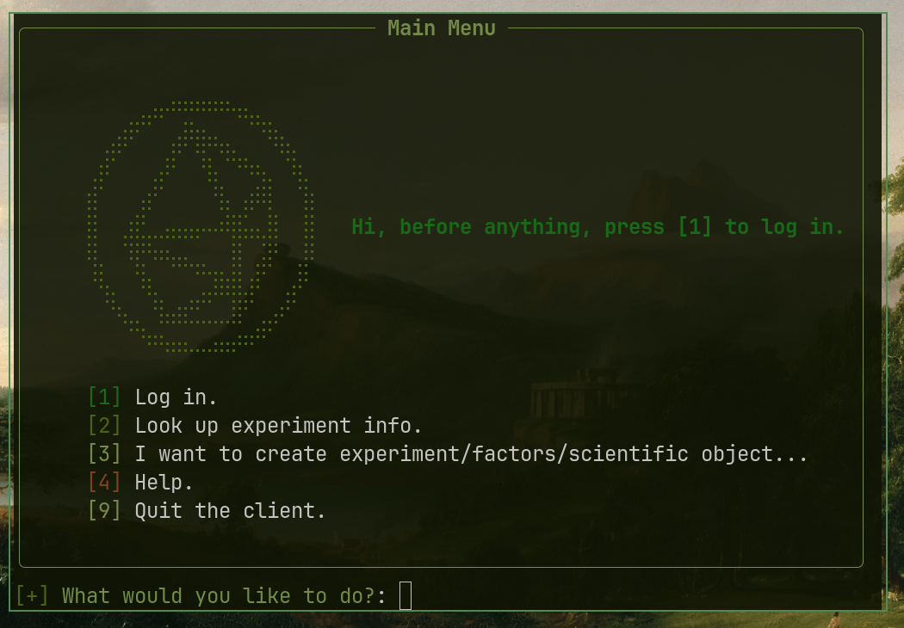
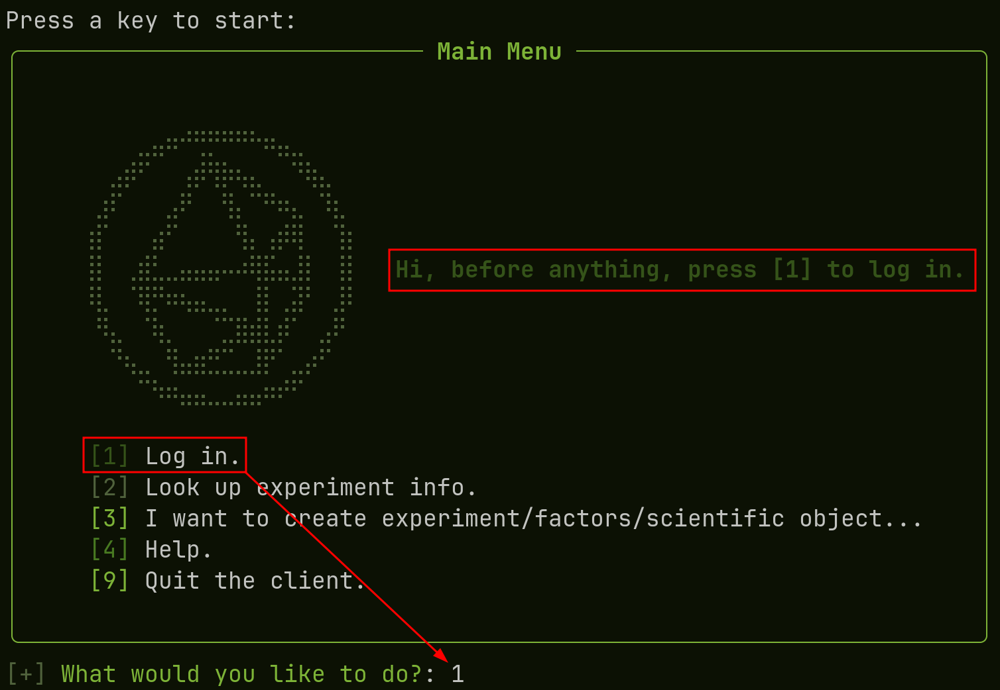
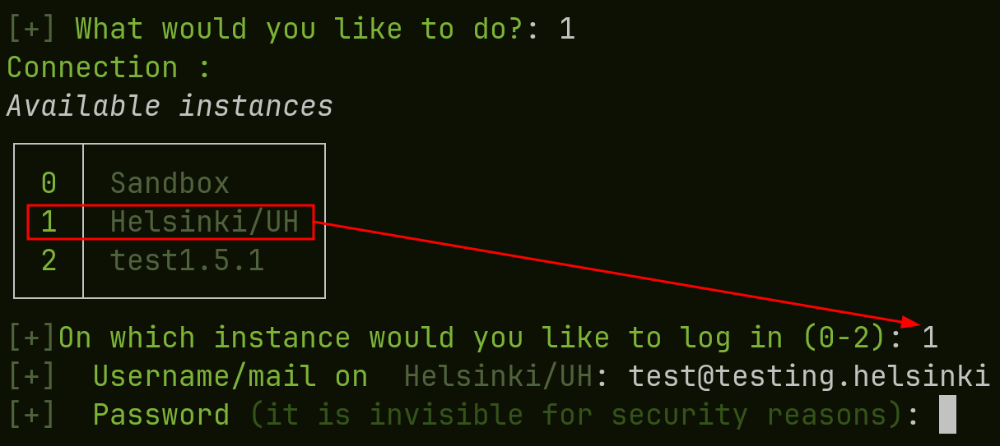
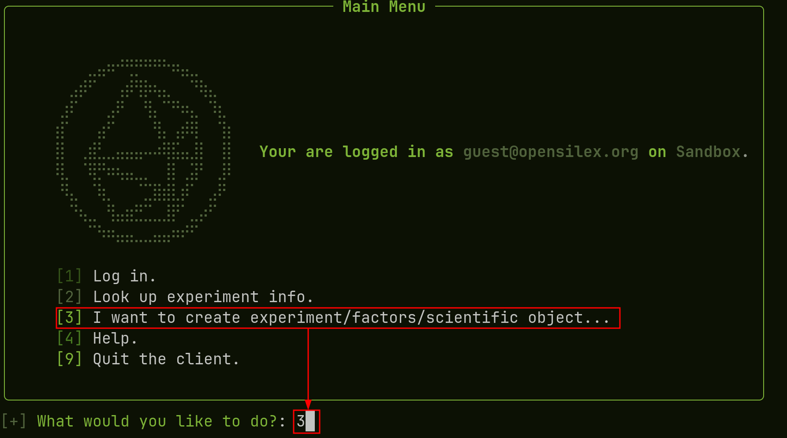
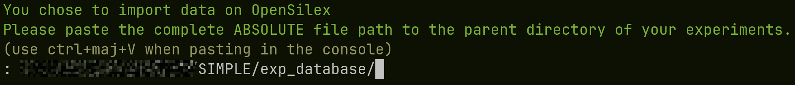
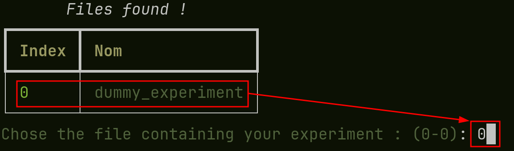
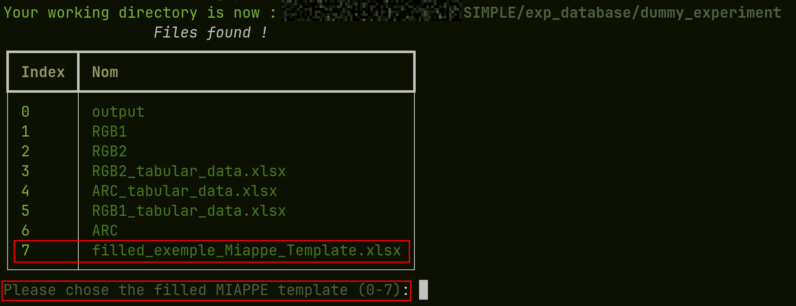
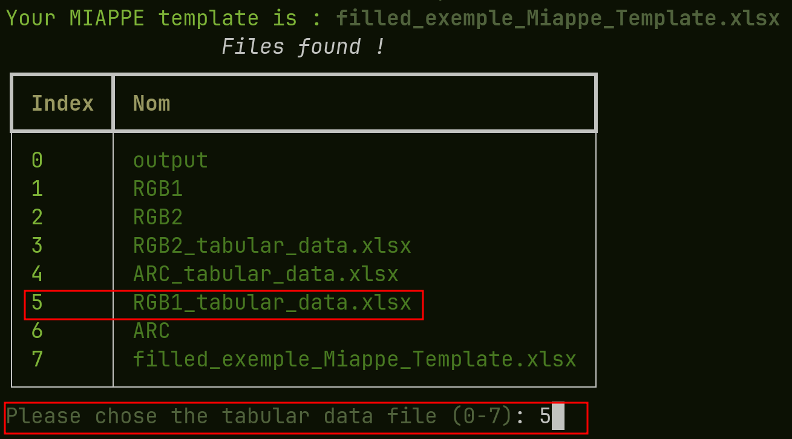
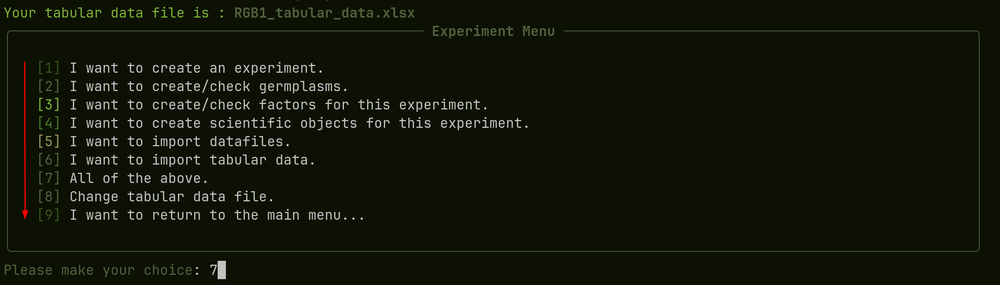
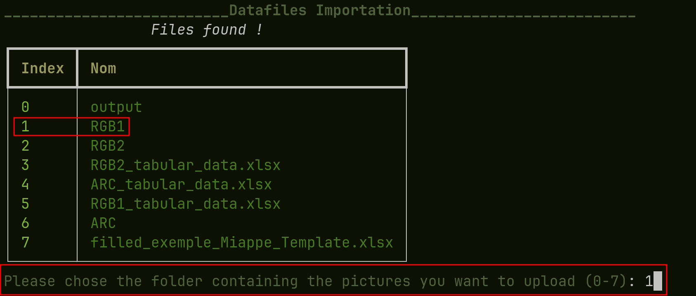

# Importing data with the CLI

{: .highlight}
The following steps are to follow only after you filled your miappe template and organized your folder accordingly, please refer to the [index]().

## Steps  :

### Logging in

Before uploading anything, you need to log in on the instance of your choice : 

For this, we write '__1__' in the console, to select the first option, this prompts us with the choice of instances :

Here, we would like to connect to the helsinki instance, so we input '__1__' again, to select the correct instance.
We can then enter the mail and password used to log in. If you do not have your phis account, please refer to your instance manager. __You have to be registered before logging in__.

### creating an experiment

Now that we are logged in, we want to create an experiment or to upload new data, germplasms, datafiles to an already existing experiment.
First, we chose the 'I want to create an experiment' optionn by typing '3' :

Then, we have to paste the path to the __experiment database__ folder, the one containing all your other experiments (cf [experiment folder]())

We select the experiment we want to work on (there is only one in our example) by typing '0' for instance : 

We select the MIAPPE file we are using for the experiment by typing '7' here : 

We select one of the tabular datafile (cf [tabular datafile help]()) by typing '5'. This will be used to create scientific objects, to link datafiles and to upload data of course : 

We are finally prompted with options regarding the creating of the experiment and everything related. It is highly recommended to do this in the written order (1,2,3...) For an easier time, just press '7', to do everything in the correct order. You will then be able to change your tabular data, by typing '8' to upload the other data/datafiles : 

To upload datafiles (images) select the folder where they are located like so :  

## Troubleshooting 

There WILL be errors the first time you use SIMPLE, as every experiment is different. However, most of them are due to typos when filling the MIAPPE form or simple data mismatches.
For the most common errors and how to solve them, the first step is reading the error message, most of the time, it explains how to solve the issue, if this doesn't work out, you can check the created logs by opening the 'logs' folder created where the SIMPLE executable is located. You can then open the latest log, it often contains more detailed informations about what went wrong.

Please refer to the [issues]() page for informations about common errors and how to solve them.

# Example of the uploading process of a dummy experiment : 

