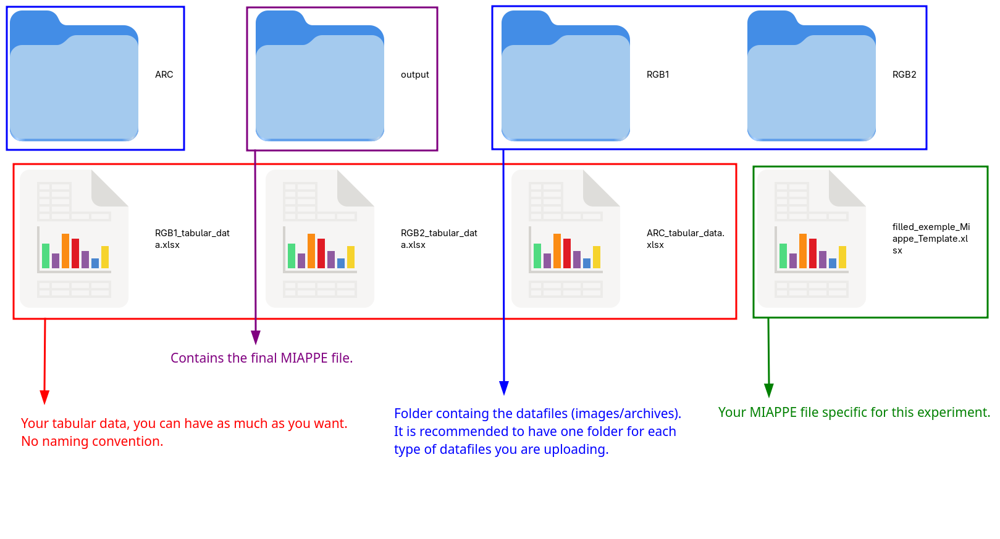

# The experiment structure.

You should put all your experiments in one folder, this will be your 'experiment database'.
**Each experiment should have a dedicated folder**, the filled miappe template for the experiment, the tabular data, the datafiles you would like to upload should all be inside this folder like so :

{: .note}
There is no naming convention for the folders nor for the files, you can do however you prefer, but try to make it as clear as possible.



Here is more information about what is inside each folders :

```bash
dummy_experiment
├── ARC
│   ├── Archive-1.zip
│   ├── Archive-2.zip
│   └── Archive-....zip
├── ARC_tabular_data.xlsx
├── filled_exemple_Miappe_Template.xlsx
├── output
│   └── miappe_template_filled.xlsx
├── RGB1
│   ├── derived
│   │   ├── RGB1-1-derived.png
│   │   ├── RGB1-2-derived.png
│   │   └── RGB1-...-derived.png
│   └── raw
│       ├── RGB1-1-raw.png
│       ├── RGB1-2-raw.png
│       └── RGB1-...-raw.png
├── RGB1_tabular_data.xlsx
├── RGB2
│   ├── derived
│   │   ├── RGB2-1-derived.png
│   │   ├── RGB2-2-derived.png
│   │   └── RGB2-...-derived.png
│   └── raw
│       ├── RGB2-1-raw.png
│       ├── RGB2-2-raw.png
│       └── RGB2-...-raw.png
└── RGB2_tabular_data.xlsx
```