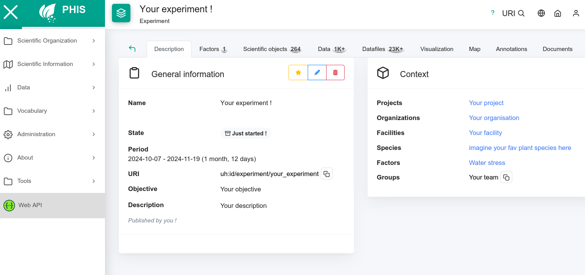

{: .new-title}
>Info
>
>This documentation was made with love, not A.I. <3

# Aim of the project :
In the context of my internship, I am working on SIMPLE, a Command Line Interface coded in python with a focus on ease of use, rapidity and flexibility. This tool will ( I hope ) help researchers upload MIAPPE compliant phenotyping data on OpenSilex instances without any efforts. Allowing them to keep germplasm banks up to date, to create experiments, create or add scientific objects to an experiment, add pictures, DATA and more.
# A simple documentation : 

This documentation is here to guide you when uploading phenomic data and metadata with corresponding images while following the MIAPPE standard on your PHIS instance !

I tried making this documentation as clear as possible, but if you have any issues/question/want to contribute, __don't hesitate to contact me__.

    

---
# What do i do now ?
Simple, just follow the instructions : 

1. ### Properly fill the MIAPPE template available on the Github.

    1. [Download MIAPPE file](https://github.com/AnEdelweiss/SIMPLE/releases/download/v0.22-minor_fixes_%26_GUI/empty_MIAPPE_template.xlsx){: .btn .btn-green }
    1. [Get help filling the MIAPPE file]()

1. ### Organize the experiment folder containing data/datafiles...

    - [Get help organizing the experiment folder]()

1. ### Format your tabular data

    - [Get help formatting the tabular data files]()

1. ### Use SIMPLE to upload your experiment

    1. [Download SIMPLE](https://github.com/AnEdelweiss/SIMPLE/releases){: .btn .btn-green }

    >{: .new-title}
    > > Recommended
    > >
    > > [Get help uploading your experiment (CLI) ]()

    >{: .highlight-title}
    > > WIP
    > >
    > >[Get help uploading your experiment (GUI) ]()

    
1. ### Look at how nice your experiment looks on your PHIS instance ! :)

    
