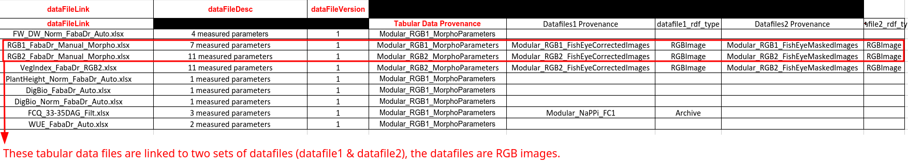
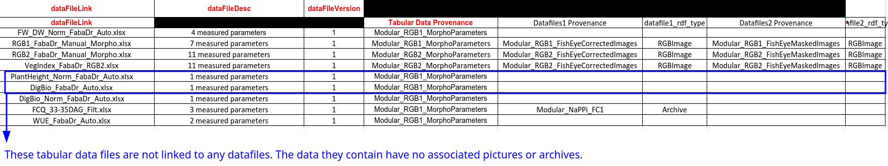
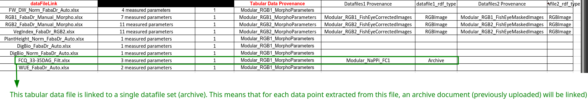
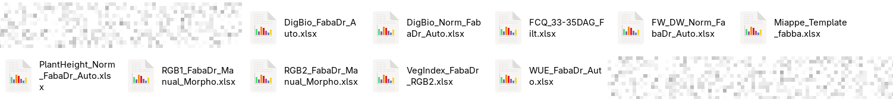

# data files sheet :

This sheet is crucial when importing datafiles (Images/archives...). You can find help regarding some important columns below :

- **dataFileLink** : refers to the **exact** name of the tabular data file that will be linked to the datafiles your are importing. With the extension.

- **dataFileDesc** : can be a description, the number of parameters in this tabular data file etc...

- **Tabular Data Provenance** : If there is no provenances yet for your instance/the data you want to upload; you **have to** create a provenance manually on your phis instance when importing data and datafiles. If there is one, simply put the exact name of the provenance to link the tabular data to it.

- **Datafiles1 Provenance** and **Datafiles2 Provenance** : With SIMPLE you can upload two sets of datafiles linked together, this canbe the raw image and the derived image. If you only have one set of datafile, just fill what is related to the first set of datafiles and leave the reste blank. Same instructions as **Tabular Data Provenance** but regarding the datafiles (Images/Archives) uploaded, please use/create another provenance specific for images.

- **datafile1_rdf_type** and **datafile1_rdf_type** : you currently have the choice between **RGBImage** and **Archive**. **Warning : this is case sensitive**. If you are importing images, use RGBImages...

Here is an example of a properly filled sheet.

 

{: .highlight}
As you can see, the 'dataFileLink' column has tobe filled with the exact names of the tabular data files.

