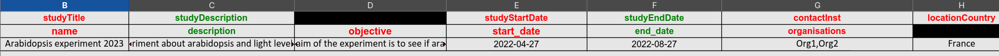
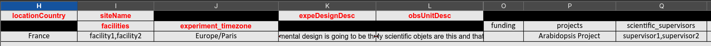
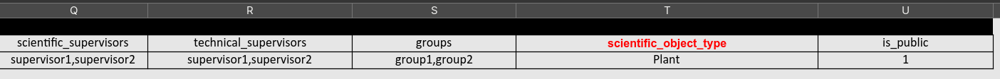

# Experiment sheet :

The experiment sheet contains crucial information about your experiment. Fill it carefully. You can find help regarding some important columns below :

- **name** : how your experiment is named, how it will be searched and displayed in PHIS.

- **start_date** and **end_date** : needs to follow this standard : "yyyy-mm-dd".

- **organisations** : You need to create the organisations by hand on your phis instance before referencing them. You can input as much organisations as you want, must be separated by commas.

- **experiment_timezone** : Needs to be filled following the timezone standards "Europe/______", if left blank, it will default to UTC. *This is also used when importing data and datafiles.* If you are not sure about your current timezone, just click on the following link : [Get my timezone](https://www.worldwideclock.com/my-time-zone)

- **facilities** : _same instructions as_**organisations**.

- **funding** : _same instructions as_ **organisations**.

- **projects** : name of the project the experiment is part of (cf project sheet 'name'). Must match exactly the displayed project name on Phis instance.

- **groups** : _same instructions as_ **organisations**. This is important because this will limit who can view/modify the experiment, you can manage groups on your phis instance. Be sure your user account is part of the group you are writing in this cell, or you might not be able to view the experiment you created.

- **scientific_supervisors** and **technical_supervisors** : _same instructions as_ **organisations**. Please enter the e-mail adresses of the supervisors. They must exist on your phis instance before you can reference them. (Create 'Person' in Phis instance)

- **scientific_object_type** : must be part of the rdf phis vocabulary. Has only been tested for 'Plant' so far... Other types may be 'Plot', 'seed', 'leaf'...

- **is_public** : just write 1

Here is an example of a properly filled sheet.

 

