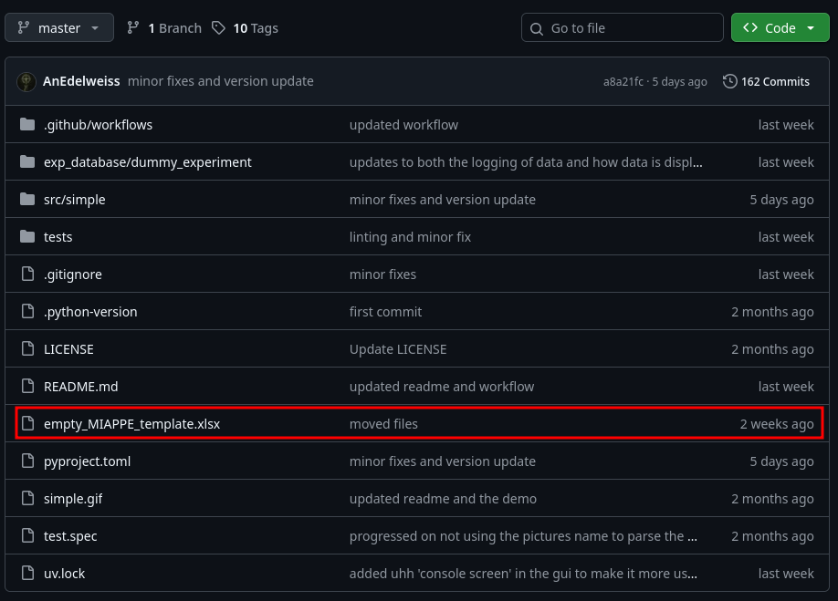
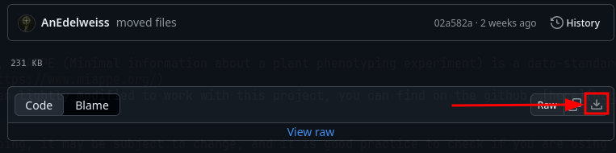
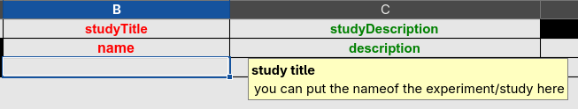

{: .warning }
This documentation is a Work In Progress. It is actively being worked on.

# The MIAPPE file.

{: .no_toc }
Let's start with the MIAPPE file : MIAPPE (Minimal information about a plant phenotyping experiment) is a data-standard maintained by a community of volunteers, you can check it out here : [link](https://www.miappe.org/)
The basic MIAPPE template has been lightly modified to work with this project, you can find on the github : [here](https://github.com/AnEdelweiss/SIMPLE/blob/master/empty_MIAPPE_template.xlsx).

Since the developement is still ongoing, it may be subject to change, and it is good practice to check if you are using the latest version available, this can be done by following updates.
As previously stated,the regular MIAPPE file has been modified to account for new columns corresponding to Phis vocabulary, this is the second row, please, do not rename or tamper with columns and columns names as it would make reading it impossible by a program...

Regarding the filling of the document, it is the same as a regular MIAPPE file and the color code should be respected : __red = mandatory__, green = recommended, black = optional; __if only one of two column name are red it means it still means the information is required.__
As you may have noticed, I annotated most cells of the MIAPPE file, telling you how each cell should be filled when you put your mouse on the cell;

However, you will find below tips and guidelines to aid you in filling properly the document, sheet by sheet if there is anything important or complex on that sheet.

