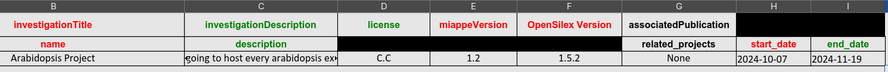
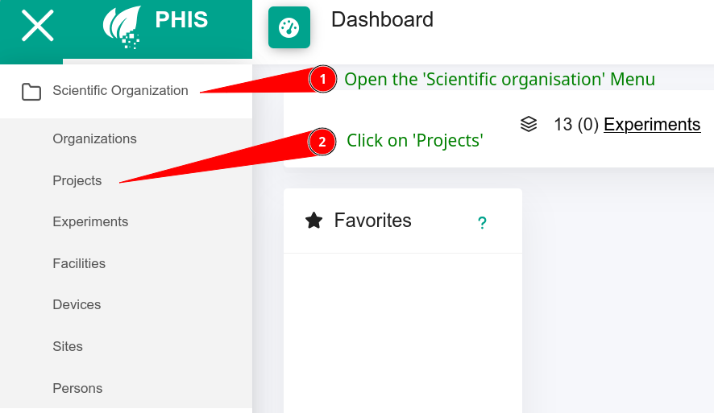
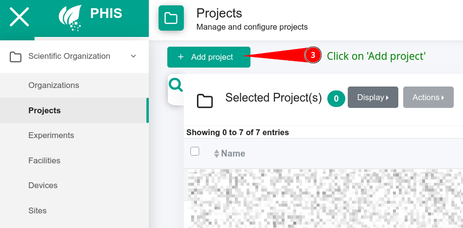
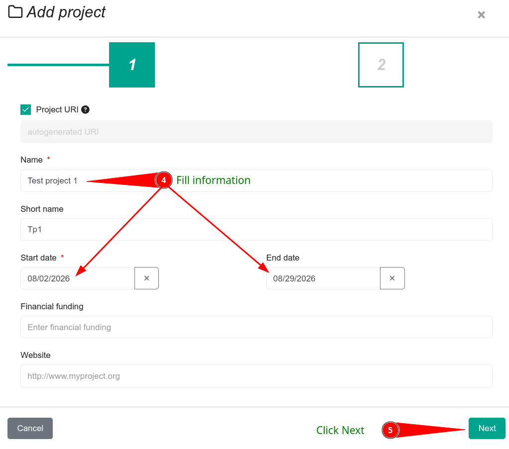
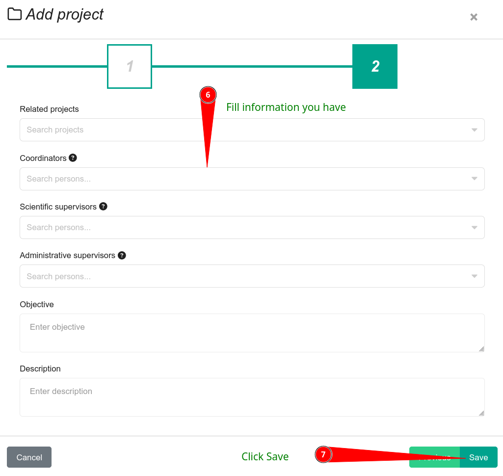

# Project sheet :

In the PHIS vocabulary, a project can host multiple experiments. Here is where you will fill information about the project in which your experiment belongs.

{: .warning }
The project has to be created by hand on your phis instance before being referenced in the MIAPPE file, SIMPLE does not create projects.

The project name, in the 'name' column must **exactly the same** as the one displayed on your phis instance.

Here is an example of a properly filled sheet.

{: .note }
To create a project on your phis instance, please do as follows. 

 

