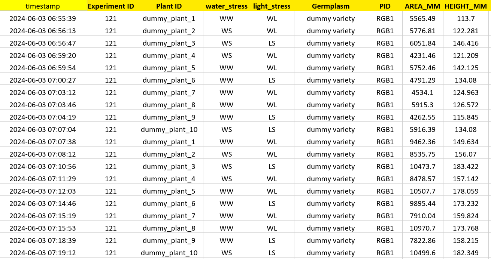
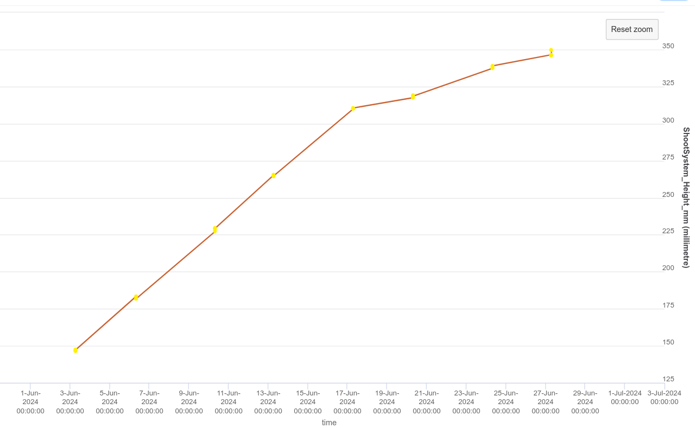
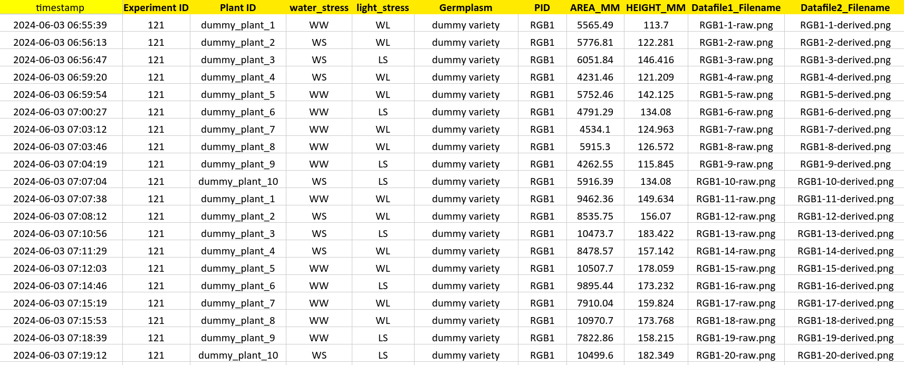
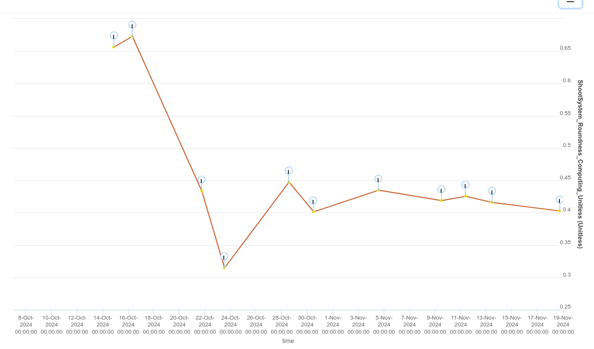

# The tabular data file.

{: .highlight-title }
>Nota bene
>
>*All column names are case sensitive.*
>
>*All Tabular data files __MUST HAVE__ the .xlsx extension and __MUST BE__ stored in the experiment's folder.*

## Mandatory modifications:

There is only two mandatory columns for tabular data, the 'timestamp' column and the 'germplasm' column.

- the **timestamp** column should contain the timestamp of when the data was collected following the standard : 'YYYY-MM-DD HH:MM:SS'.
  Valid exemples would be : 2025-01-12 12:10:56...

- the **Plant ID** column should contain a unique identifier related to the plant, this will be useful when creating scientific objects. One scientific object will be created for each different 'Plant ID'.

- the **Germplasm** column should contain the germplasm's name.
  Valid exemples would be : 

- And now you need to add columns for the data, each column containing data must be named after the variable name you gave in the MIAPPE. (cf [MIAPPE mapping table]() )  

Here is an example of a properly filled sheet. You can see there is two variables at the end **AREA_MM**	and **HEIGHT_MM**. 
This data will not be linked to data files.

Here is how it would appear on your phis instance if you visualize one variable of one scientific object. Each yellow point represents a data point :

## Importing datafiles:

**If you would like to link data to datafiles** (images, archives) you also need to create a column named '**Datafile1_Filename**' stating **for each row** the exact name of the datafile. This will be the first set of datafiles. If there is a second set of datafiles, derived from the first one, you will need to create a second column named '**Datafile2_Filename**' stating **for each row** the exact name of the datafile.

- the **Datafile1_Filename** & **Datafile2_Filename** columns should contain the **exact filename** of the datafile, with it's extension (.png,.jpeg, .tar, .png etc). If your images follow strict naming conventions and are named after information that can be easily retrieved within the excel, this process can be automated via scripts of any kind.
Valid exemples would be : 
  - 121_9_2024-06-24_07-24-41_2024_ToAB_Stress_79.png
  - Archive-12.tar
  - 163-38-24_KuKa_117-Cst-L-1.1-Area_02-RGB2-FishEyeMasked.png

Here is an example of a properly filled sheet. You can see there is two variables at the end **AREA_MM**	and **HEIGHT_MM**. 
Now, for each data point, there will be an image linked to it when visualizing it on your phis instance. The image path/name will also be present in the metadata of the data point.

{: .note}
Since there is two datafiles set given in this example (**Datafile1_Filename** & **Datafile2_Filename**) there will be two images per datapoints, but you can also put only the **Datafile1_Filename** column in your tabular data file; to only upload one datafile per data point, like on the visualisation at the end of this page.

Here is how it would appear on your phis instance if you visualize one variable of one scientific object, each blue circle represents an image :

